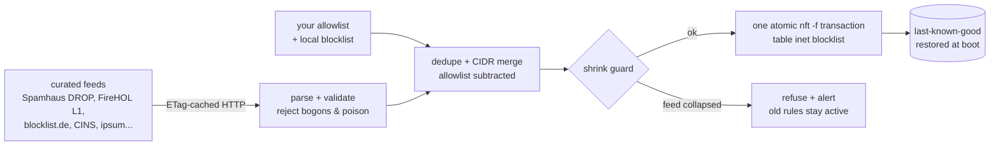

# nft-blocklist

Atomic **nftables IP blocklist manager** for Linux servers. Fetches curated
threat-intelligence feeds, validates and merges them, and applies the
result as native nftables sets — in one kernel transaction, so your
firewall is never half-updated and never unprotected during a refresh.

This is the v2 rewrite of `iptables-ipset-blacklists` (2014). The legacy
iptables/ipset Bash script lives frozen in [legacy/](legacy/);
[docs/migration-from-v1.md](docs/migration-from-v1.md) shows how to switch.

> **Scope honestly stated:** IP blocklists are a noise-reduction control,
> not a security boundary. They cut log spam, scanner traffic and known-bad
> actors so your IDS/monitoring can see real attacks — they do not replace
> patching, MFA, SSH hardening, or a WAF.

## How it works



Key properties, each enforced by tests:

- **Atomic**: the generated ruleset applies entirely or not at all
  (`nft -f` transaction). No exposure window during updates.
- **Fail closed**: any fetch/parse/apply failure leaves the previous rules
  active; a **shrink guard** refuses updates that would silently drop most
  of your protection when an upstream feed dies.
- **Allowlist wins, always**: allowlisted IPs are subtracted from every
  feed *and* accepted by an early rule; if one shows up in a feed you get
  an `allowlist_collision` alert instead of an outage.
- **Feed hygiene**: bogons, private ranges, default routes and absurdly
  broad prefixes are rejected; scored feeds (ipsum) filter by confidence;
  HTML error pages don't pass as empty lists.
- **Plays well with others**: its own `table inet blocklist` at priority
  -150 coexists with firewalld and UFW (never edits their tables), and a
  separate `dynamic` set integrates [fail2ban](fail2ban/) bans that feed
  updates can never clobber.
- **Kind to providers**: per-feed minimum fetch intervals, conditional
  requests (ETag/Last-Modified), and timer jitter.
- **Observable**: journald logs, `status` against the live kernel, and
  pluggable notifications (webhook → Discord/Slack/Telegram today,
  command → signal-cli/anything; see
  [docs/notifications.md](docs/notifications.md)).

## Quick start

```sh
# install the package (Releases page), then:
sudo vi /etc/nft-blocklist/allowlist.txt     # 1. add YOUR management IPs first
sudo nft-blocklist update --dry-run | less   # 2. review the exact ruleset
sudo nft-blocklist update                    # 3. apply
sudo systemctl enable --now nft-blocklist.timer          # daily + jitter
sudo systemctl enable nft-blocklist-restore.service      # protection at boot
nft-blocklist status
```

Distro guides: [Ubuntu/Debian](docs/debian-ubuntu.md) ·
[RHEL/Rocky/Alma/Fedora](docs/rhel-family.md) · [SLES/openSUSE](docs/suse.md)

## Commands

| Command                        | Purpose                                       |
|--------------------------------|-----------------------------------------------|
| `update` `--dry-run` `--force` | fetch, merge, atomically apply                |
| `validate`                     | check config + feeds.d without touching state |
| `status`                       | last run summary + live kernel set counts     |
| `rollback`                     | re-apply the last-known-good ruleset          |

## Configuration

`/etc/nft-blocklist/config.yaml` plus one YAML per feed in `feeds.d/`
(strictly validated — typos are errors, not surprises). Shipped defaults:
Spamhaus DROP (v4+v6), FireHOL level1, blocklist.de, CINS Army, and ipsum
with a ≥3-lists confidence threshold; abuse.ch C2 feeds and Tor exit nodes
are included but disabled (aggressive feeds require an explicit
`acknowledge_risk: true`). See [configs/](configs/) — every option is
documented in place.

## Development

Go 1.26+, table-driven unit tests, golden-file ruleset tests, real-kernel
integration tests in unprivileged network namespaces (`make integration` —
no sudo needed), and a five-distro Vagrant e2e matrix (`make e2e`).
Architecture and design rationale: [docs/architecture.md](docs/architecture.md).
Contributing and task-brief conventions: [CONTRIBUTING.md](CONTRIBUTING.md).

## License

MIT — see [LICENSE](LICENSE).
