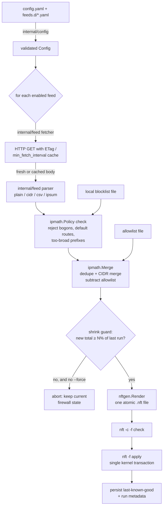
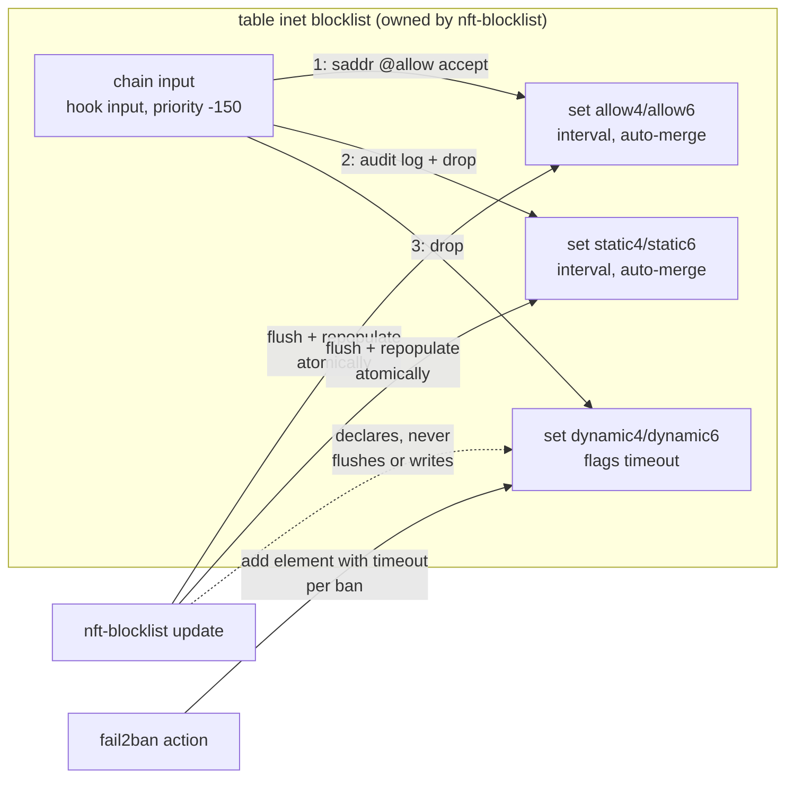
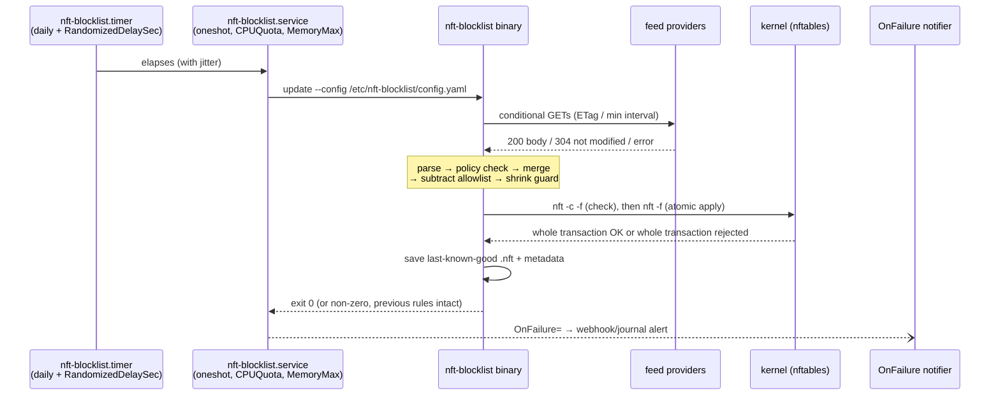

# nft-blocklist architecture

`nft-blocklist` downloads curated IP threat feeds, normalizes and merges
them, and atomically installs the result as native nftables sets. It is the
v2 rewrite of the 2014 `blacklists.sh` iptables/ipset script.

## Why this design

The v1 script had four structural problems that shaped every decision here:

1. **Non-atomic updates.** A bash loop of `ipset add` calls that dies halfway
   leaves the firewall partially updated. nftables executes an entire
   `nft -f` file as **one kernel transaction** — it fully applies or nothing
   changes — so the whole pipeline funnels into generating a single file.
2. **Deprecated stack.** RHEL 9+ deprecates ipset/iptables; Ubuntu 22.04+ and
   SLES 15+ are nftables-native. We use a dedicated `table inet blocklist`
   that *coexists* with firewalld/UFW instead of fighting them for ownership.
3. **Trusting feeds blindly.** Feeds die, change format, or serve HTML error
   pages with HTTP 200. Every entry passes a safety policy (no default
   routes, no private/special ranges, no absurdly broad prefixes), and a
   shrink guard refuses updates that would silently drop most protection.
4. **cron + cpulimit fragility.** systemd timers give jitter (so thousands of
   installs don't stampede feed providers at midnight) and cgroup limits
   (`CPUQuota=`, `MemoryMax=`) replace the cpulimit SIGSTOP/SIGCONT hack.

## Update pipeline

One `nft-blocklist update` run:

Package responsibilities mirror the pipeline stages exactly; anything pure
(parsing, IP math, rendering) has no I/O so it can be unit-tested
exhaustively, and the two impure edges (HTTP, nft) sit behind interfaces.

## nftables object model

Why three set pairs:

- **allow** — the allowlist wins over everything, evaluated first. It is
  subtracted from the static sets at build time *and* enforced as an accept
  rule, so even a hand-added element can't block an allowlisted IP.
- **static** — feed-derived entries. Flushed and repopulated inside the same
  transaction on every update, so there is no unprotected window.
- **dynamic** — owned by reactive tools (fail2ban). Feed updates declare it
  (so rules can reference it on first boot) but never flush it or write
  elements: a feed refresh must never un-ban an active attacker or clobber
  fail2ban's state. Verified by `TestDynamicSetsNeverFlushed`.

Priority -150 runs before firewalld (default 0 for filter input) and UFW
chains, without editing tables those tools own — Red Hat explicitly warns
against two managers editing the same tables.

## Update sequence (systemd)

At boot, `nft-blocklist-restore.service` applies the saved last-known-good
file *before* the network is fully up — the v1 script's `.sav` restore had
the same goal: never face the internet unprotected while feeds re-download.

## Failure philosophy

Fail **closed at the kernel, open at the pipeline**: any error in fetching
or parsing one feed degrades to that feed's `fail_policy` (cached copy or
skip), any error in the final apply changes nothing at all, and only a
successful full transaction replaces the last-known-good file used by boot
restore and `rollback`.

## Repo layout

| Path                | Purpose                                              |
|---------------------|------------------------------------------------------|
| `cmd/nft-blocklist` | CLI entry point (thin; logic lives in `internal/`)   |
| `internal/…`        | pipeline stages, one package per stage (see diagram) |
| `configs/`          | example config + curated `feeds.d/` catalog          |
| `systemd/`          | service/timer/restore/notify units                   |
| `fail2ban/`         | action + jail examples targeting the dynamic sets    |
| `test/fixtures/`    | feed bodies shared by unit + integration + e2e tests |
| `test/integration/` | real-kernel tests in network namespaces              |
| `test/e2e/`         | Vagrant matrix + hermetic fixture feed server        |
| `legacy/`           | frozen v1 bash script (unmaintained)                 |
