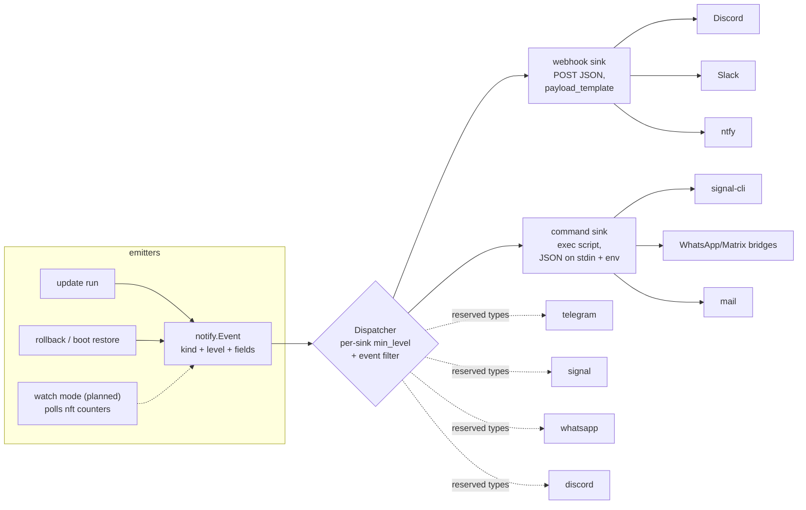

# Notifications and messaging hooks

`nft-blocklist` emits structured **events** which fan out to configured
**sinks**. The design goal: a perimeter tool must never fail silently (the
v1 script emailed root via a local MTA that modern hosts don't have), and
alert delivery must be pluggable — Telegram, Signal, WhatsApp and Discord
are first-class citizens of the schema even before native transports ship.

## Event flow



Delivery failures are logged but **never** fail the firewall operation:
protecting the host outranks telling someone about it.

## Event catalog

Kinds are stable API — sink filters match on these strings; never renamed,
only added.

| Kind                  | Level    | Meaning / why you care                                                     |
|-----------------------|----------|----------------------------------------------------------------------------|
| `allowlist_collision` | warning  | One of *your* allowlisted IPs appeared in a threat feed. It was not blocked (allowlist wins), but either your host/IP is compromised and got itself listed, or the feed is poisoned. A human must look. |
| `update_failed`       | critical | The update aborted. The previous ruleset is still active (atomic apply), but feeds are no longer refreshing. |
| `shrink_guard`        | critical | The new dataset shrank below the guard threshold and was refused — usually a dead or truncated upstream feed. |
| `feed_degraded`       | warning  | A feed failed and its `fail_policy` kicked in (stale cache used, or feed skipped this run). |
| `update_applied`      | info     | Success summary: per-feed and total entry counts. Off by default (`min_level: warning`). |
| `rollback`            | warning  | Operator or boot-restore re-applied the last-known-good ruleset.            |
| `drop_spike`          | critical | *Planned:* blocked-packet counters rising abnormally fast — likely (D)DoS or scan burst. See below. |

### About `drop_spike` (DDoS heuristic)

Every drop rule carries a `counter`. A oneshot daily update can't watch
those in real time, so spike detection belongs to a planned
`nft-blocklist watch` mode (or timer-driven `--check-counters` run) that
samples `nft -j list counters`, compares against the previous sample, and
emits `drop_spike` when the delta rate crosses a configured threshold. The
event kind, level plumbing, and sink filters already exist so configs can
subscribe to it today. Honest caveat: this observes *blocked* volume — a
true volumetric DDoS saturates the link before nftables sees it; this
heuristic is for "the blocklist is suddenly working very hard" awareness,
not a mitigation system.

## Configuration

```yaml
notifications:
  min_level: warning          # default threshold for all sinks
  sinks:
    # Discord, today, via the generic webhook sink:
    - name: ops-discord
      type: webhook
      url: https://discord.com/api/webhooks/1234/abcd
      payload_template: '{"content": "**{{.Title}}** on {{.Host}}: {{.Message}}"}'
      min_level: warning
      events: [allowlist_collision, update_failed, shrink_guard, drop_spike]

    # Anything scriptable via the command sink (signal-cli shown):
    - name: signal
      type: command
      command: /usr/local/bin/notify-signal.sh
      min_level: critical
```

A command-sink script receives the full event JSON on stdin plus
`NFTBL_EVENT`, `NFTBL_LEVEL`, `NFTBL_TITLE`, `NFTBL_MESSAGE`, `NFTBL_HOST`
environment variables:

```sh
#!/bin/sh
# /usr/local/bin/notify-signal.sh
signal-cli -a +614XXXXXXXX send -m "[$NFTBL_LEVEL] $NFTBL_TITLE: $NFTBL_MESSAGE" +614YYYYYYYY
```

Telegram, today, without a native sink:

```yaml
    - name: telegram
      type: webhook
      url: https://api.telegram.org/bot<TOKEN>/sendMessage
      payload_template: '{"chat_id": "<CHAT_ID>", "text": "{{.Title}} on {{.Host}}: {{.Message}}"}'
```

## Reserved sink types

`type: telegram|signal|whatsapp|discord` are recognized by the schema and
rejected with a *"not implemented yet — use webhook/command meanwhile"*
message (not "unknown type"). When a native transport lands, it is one new
case in `notify.Build` plus removing the type from
`config.ReservedSinkTypes`; existing configs and event filters keep working
unchanged.

## Adding a native sink later (task brief shape)

1. Implement `notify.Sink` in `internal/notify/` (see `webhookSink`).
2. Add its `case` to `notify.Build`, remove from `config.ReservedSinkTypes`,
   add its settings fields to `config.NotifySink` (strict YAML will reject
   typos automatically).
3. Table-driven tests against `httptest` (or a fake binary for exec-based
   transports). No live API calls in tests.
4. Document the sink here with a config example.
